# Simple CI/CD demo with CircleCI and Heroku

This repository contains the code for a little workshop to create a CI/CD pipeline.
The application used for this workshop is a simple Hello World app, written in Nodejs, that exposes an http endpoint. 
This can be deployed to Heroku with CircleCI.

You can decide on your own if you want to follow all steps. Deployment to Heroku is optional.

## Repository content
```
.
├── __tests__               # Unit test files
├── .circleci               # Directory with CircleCI configuration
├── build                   # Compiled files (generated code)
├── images                  # Images for documentation
├── node_modules            # Directory with dependencies (auto generated)
├── index.js                # Main entry point of the application
├── package.json            # The package.json contains all dependencies of this project and defines scripts to build and test the project
├── Procfile                # The Procfile is used by Heroku to determine the startup command for this application
├── randomNumber.js         # Dummy code to generate a random number
├── rollup.config.js        # Build configuration file
├── yarn.lock               # Lock file for nodejs dependencies
├── LICENSE
└── README.md
```

## Prerequisites for following CI/CD workshop
* [Github account](https://github.com/join)
* [CircleCI](https://circleci.com/signup/) access (via Github Single Sign on)
* (optional) a free [Heroku](https://signup.heroku.com/login) developer account.

## Steps
### Fork this repository
You can create your own fork of this repository by clicking the fork button at the top of this page. Make sure you are signed in to github.com!
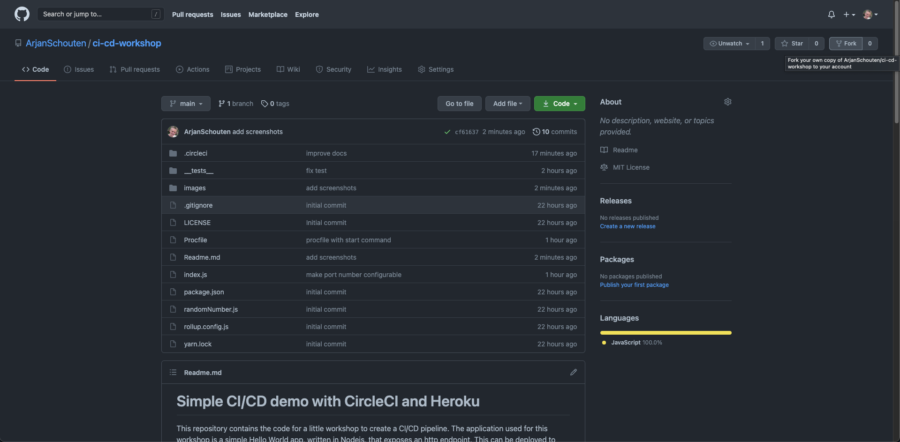

Clone the forked git repository by clicking the "Code" dropdown button and follow the steps.
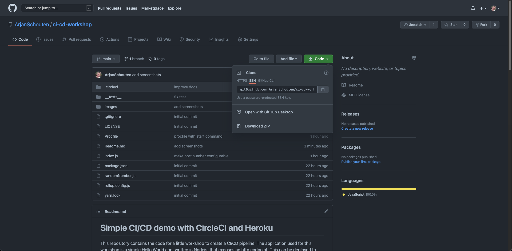

### CircleCI
* Sign in to [CircleCI](https://circleci.com/signup/).
* Open the Projects tab
  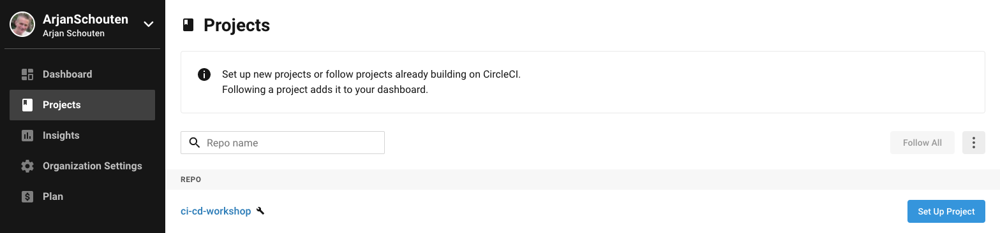
* You will see your forked github repository
* Click "setup project"
* You will see CircleCI trying to help us with a basic template. We'll use our own ;)
  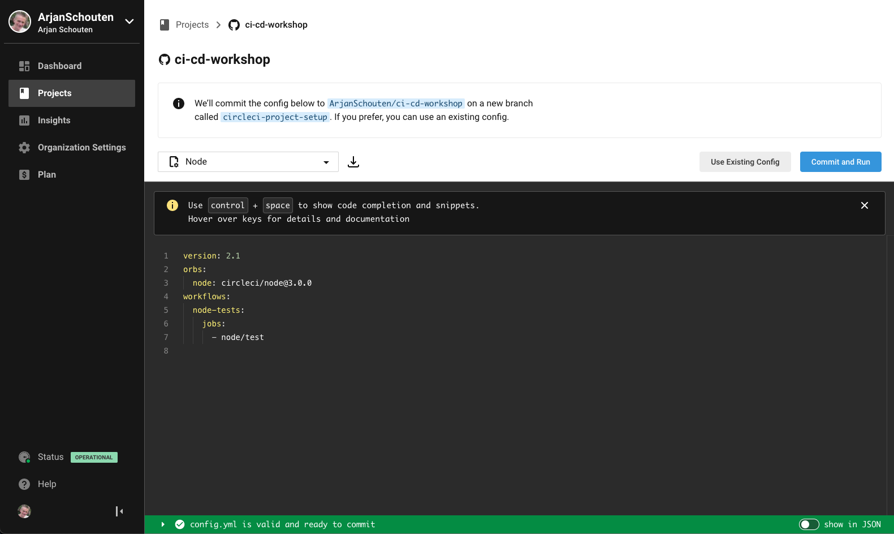
* Click Use existing config once you commited the .circleci/config.yml file
* The pipeline must be configured in the repository you just cloned:
  * Create a .circleci/config.yml file
    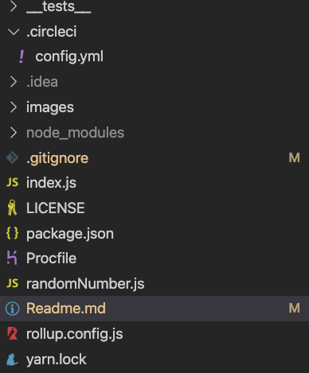
  * The first thing we need in the config.yml is the version of the circleci config.yml we want to use and the [orbs](https://circleci.com/orbs/):
```yaml
version: 2.1

# Orbs are shareable packages of CircleCI configuration you can use to simplify your builds.
orbs:
  # The Heroku orb is used to simplify the deployment to Heroku
  heroku: circleci/heroku@1.2.6
```
  * After that we need to define a [workflow](https://circleci.com/docs/2.0/workflows/):
    
    In that workflow we define the jobs (different steps in a pipeline) and the relation between those jobs. Some jobs might depend on each other, we only want to deploy when tests have succeeded for example. 
```yaml
workflows:
  version: 2
  build-test-deploy:
    jobs:
      - build
      - test:
          requires:
            - build
```
  * After defining the workflow we have to define the jobs themselves. The build job looks like this:
```yaml
jobs:
    # This job builds the application.
    build:
      docker:
        - image: node:current-alpine
      steps:
        # Checkout the git repository
        - checkout
        - run:
            name: build
            # The yarn build command is configured in the package.json under scripts
            command: |
              yarn
              yarn build
        - store_artifacts:
            path: build/index.js
        - persist_to_workspace:
            root: .
            paths:
              - .
```
  * We defined one more job in our workflow, the test job:
```yaml
jobs:
    #... build job from previous step...
  
    # Our pipeline is responsible for testing our software.
    # If one or more tests fail, the deployment shouldn't get executed.
    test:
      docker:
        - image: node:current-alpine
      parallelism: 1
      steps:
        - checkout
        - attach_workspace:
            at: .
        - run:
            name: Run tests
            # The test command is configured in the package.json.
            command: |
              yarn
              yarn test
```
* Commit the changes to .circleci/config.yml to github.
* Switch back to the CircleCI page in your browser. You'll that see circleci created a pipeline
  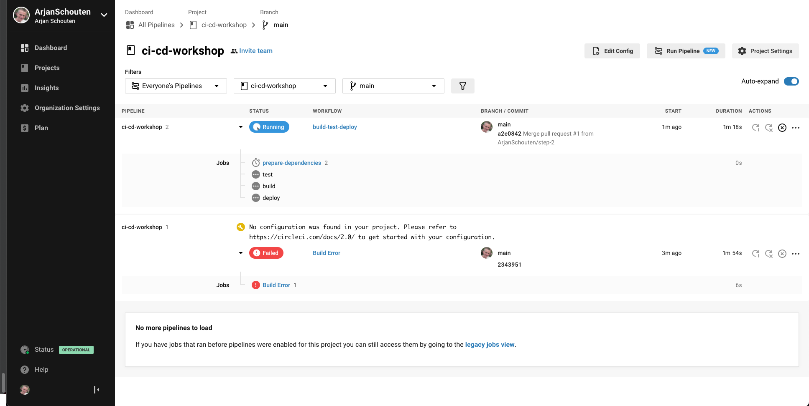
* It will start the workflow with all jobs every time you commit!
* See that one test failed! Fix it by changing the `__tests__/randomNumber.test.js`
* Commit again and wait until the pipeline ran the latest commit.

**You defined a simple pipeline definition which makes sure you can build your software and that all tests succeeded!**

### Heroku
In the next step we take our app that is build by the pipeline and deploy it somewhere so we can release functionality 
to our users by only committing to a git repository.

Sign up to [Heroku](https://signup.heroku.com/login). Create your account.
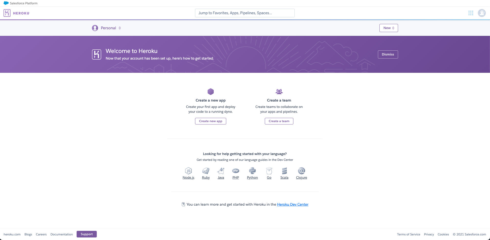

Once you signed up, click create app
* Give your app a unique name
  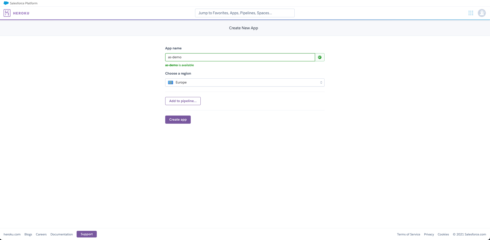
* Create app (without pipeline since we use circleci)
* Nice, you have your app configured in Heroku.

Till this point we haven't released the actual application code. That's what our pipeline can do for us.

Now get your api key from Heroku:
* Go to your account tab
  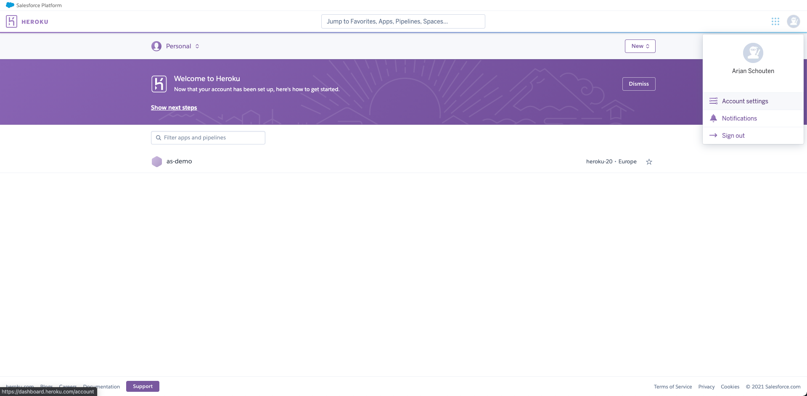
* Scroll down to the Api Key section and save your api key which we will use later
  

Now switch back to circleci and configure Heroku secrets (secrets are one of the common exceptions to the everything in sourcecontrol paradigm, although it is not impossible to also have secrets encrypted in sourcecontrol).

Go to the Project Settings in CircleCI and click the tab Environment Variables
* Click Add Environment Variable
  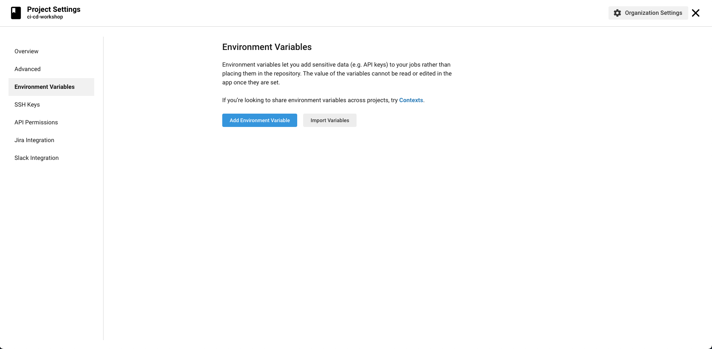
* Configure the HEROKU_APP_NAME variable and configure the Heroku App name which you created before.
* Next, configure the HEROKU_API_KEY which you obtained before.
  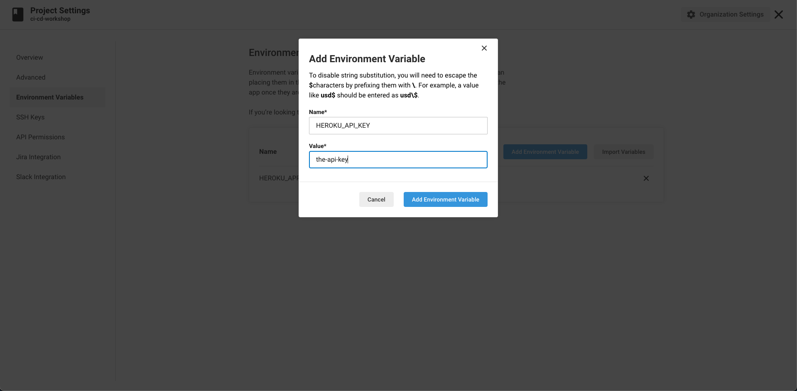

## Update the config.yml
* Update the config.yml, as you might now already, we have to update the workflow with the jobs and the relationships between the jobs.
* After the workspace is done, we have to configure the job:
```yaml
    deploy:
      executor: heroku/default
      steps:
        - attach_workspace:
              at: .
        # Use the Heroku orb and deploy via heroku's git repository.
        # This step needs the HEROKU_API_KEY and HEROKU_APP_NAME variables to be set.
        # See Readme.md for details.
        - heroku/deploy-via-git
```
* Note that the job uses an orb, a predefined macro that is able to deploy to Heroku. We don't have to know all the details
which makes it easier for this demo.
* Commit the `config.yml` and the pipeline in CircleCI should deploy the app to Heroku.

Now go back to Heroku and open your app.
You'll see that Heroku received a deployment from CircleCI.
* Click the open app button
* You'll see your app printing "Hello world"
* From here, try to change the application to print "Deployed via pipeline!" (hint see `./index.js`)
* Commit your changes and without doing a thing your application will be updated.

### Cleanup
Remove your application from Heroku and delete the CircleCI pipeline when you're done. 

## Building and testing
**To follow the CI/CD workshop you don't need to build and test on your local machine!**

In case you want to build and test locally:
* Install [nodejs 14+](https://nodejs.org/en/)
* Install [yarn](https://yarnpkg.com/)
* Run 

`yarn install`

`yarn build`

`yarn test`
